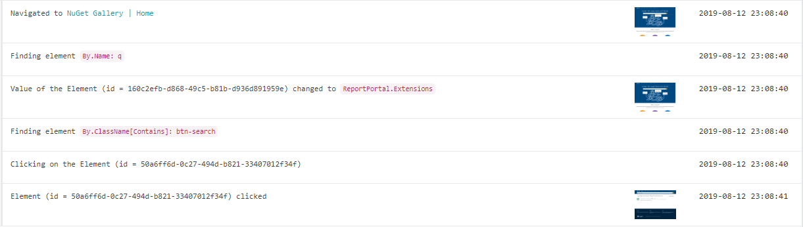

Install `ReportPortal.Extensions.Selenium` nuget package and see logs from `Selenium.WebDriver` in your report https://reportportal.

# Connecting
Just add `.AddReportPortal()` where you initialize new instance of WebDriver.

```csharp
using ReportPortal.Extensions.Selenium;
...
var webDriver = new OpenQA.Selenium.Firefox.FirefoxDriver().AddReportPortal();
...
```

